# Architecture

This document describes every system in the zacharymetz.com codebase in detail. It is a reference companion to the practical how-to guides in `README.md`.

The site is a hand-rolled React SSR framework built on Express 5, Vite 6, React 19, and React Router 7. There is no meta-framework (no Next.js, no Remix). Specific routes are server-rendered for SEO, all other routes fall through to a client-side SPA shell, and after the first page load the app transitions permanently into SPA mode for all subsequent navigation.

---

## Table of Contents

1. [High-Level Overview](#1-high-level-overview)
2. [Express Server](#2-express-server)
3. [SSR Rendering Engine](#3-ssr-rendering-engine)
4. [Client Entry](#4-client-entry)
5. [SSR Context System](#5-ssr-context-system)
6. [Data Flow and usePageData](#6-data-flow-and-usepagedata)
7. [Root Component and Routing](#7-root-component-and-routing)
8. [Type System](#8-type-system)
9. [Per-Page Route Pattern](#9-per-page-route-pattern)
10. [Robots.txt System](#10-robotstxt-system)
11. [Markdown Content Pipeline](#11-markdown-content-pipeline)
12. [Shared Components](#12-shared-components)
13. [Hooks](#13-hooks)
14. [Build Pipeline](#14-build-pipeline)
15. [CSS Architecture](#15-css-architecture)

---

## 1. High-Level Overview

Every HTTP request to the server follows one of three rendering paths. The diagram below shows the full lifecycle from initial request through to interactive page.

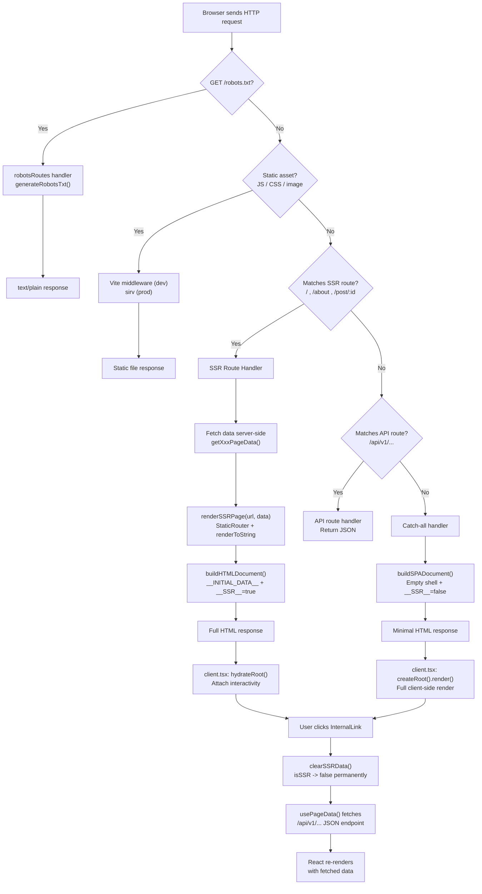

---

## 2. Express Server

**File:** `src/server.ts`

The server is bootstrapped by the async `createServer()` function. It creates an Express 5 application and registers middleware and routes in a specific order that matters for correctness.

### Middleware Stack

The order of registration determines which handler gets first crack at each request. The diagram below shows the exact order and how a request cascades.

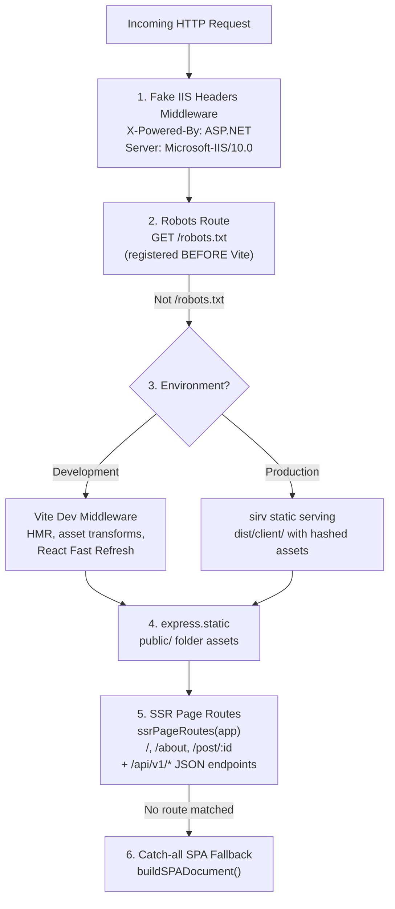

**Key detail:** The robots route is registered before Vite middleware. In dev mode, Vite's middleware intercepts all requests it can handle. If `/robots.txt` were registered after Vite middleware, Vite would try to serve it as a static file instead of letting Express generate it dynamically.

### Dev vs Prod Module Loading

The server loads SSR modules differently depending on the environment.

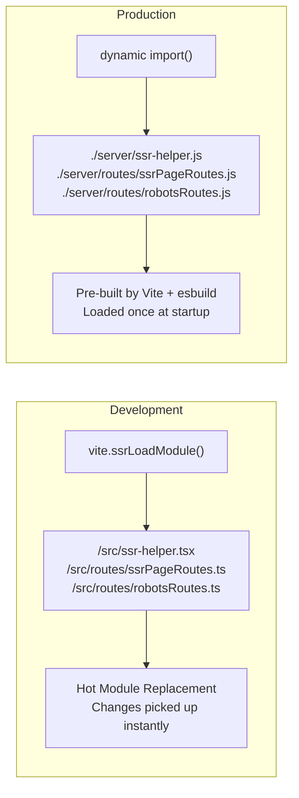

In development, `vite.ssrLoadModule()` loads TypeScript source files directly with full HMR support. In production, the modules are pre-built to `dist/server/` and loaded via standard dynamic `import()` with `// @ts-ignore` annotations since the paths only exist at runtime.

The server also:
- Disables the default Express `x-powered-by` header and replaces it with fake ASP.NET/IIS headers (a humorous touch).
- Reads `PORT` from environment variables, defaulting to `3000`.
- In production, resolves all paths relative to `__dirname` (which is `dist/` when running `dist/server.js`).

---

## 3. SSR Rendering Engine

**File:** `src/ssr-helper.tsx`

This file is the core of the SSR system. It exports three functions that the rest of the server uses.

### renderSSRPage(url, data)

Renders the full React application to an HTML string on the server.

```typescript
function renderSSRPage(url: string, data: AppData): SSRResult
```

Wraps `<App data={data} />` inside `<StaticRouter location={url}>` and `<SSRProvider>`, then calls `renderToString()` from `react-dom/server`. Returns `{ html, data }`.

`StaticRouter` is the server-side equivalent of `BrowserRouter` -- it reads the URL from the `location` prop instead of the browser's address bar.

### buildHTMLDocument(title, description, html, data, isSSR)

Wraps server-rendered HTML into a complete HTML document.

```typescript
function buildHTMLDocument(
  title: string,
  description: string,
  html: string,
  data: AppData,
  isSSR: boolean = true
): string
```

The generated document includes:
- `<meta>` tags for title and description (SEO).
- Favicon link (`/coffee.png` for SSR pages).
- CSS `<link>` tags (from manifest in production, empty in dev since Vite injects them).
- The rendered HTML inside `<div id="root">`.
- `<script>window.__INITIAL_DATA__ = {...}</script>` -- serialized page data for client hydration (only when `isSSR` is true).
- `<script>window.__SSR__ = true/false</script>` -- tells the client whether to hydrate or fresh-render.
- Client entry `<script>` tags (Vite dev scripts or hashed production bundle).

### buildSPADocument()

Generates a minimal HTML shell for SPA-only routes.

```typescript
function buildSPADocument(): string
```

Similar to `buildHTMLDocument` but with:
- Empty `<div id="root"></div>` (no pre-rendered content).
- `window.__SSR__ = false` (triggers fresh client render).
- Different favicon (`/tropicalgalaxy.png`).
- Generic title ("React App").
- No `__INITIAL_DATA__` script.

### getAssetTags()

Internal function that resolves the correct `<script>` and `<link>` tags for the current environment.

- **Development:** Returns inline scripts for the Vite client (`/@vite/client`), React Fast Refresh preamble, and the source entry (`/src/client.tsx`). No CSS links needed since Vite injects styles via JS.
- **Production:** Reads `dist/client/.vite/manifest.json` (loaded once at module scope), looks up the `src/client.tsx` entry, and returns the hashed JS file path and any associated CSS files.

### SSR Render Pipeline

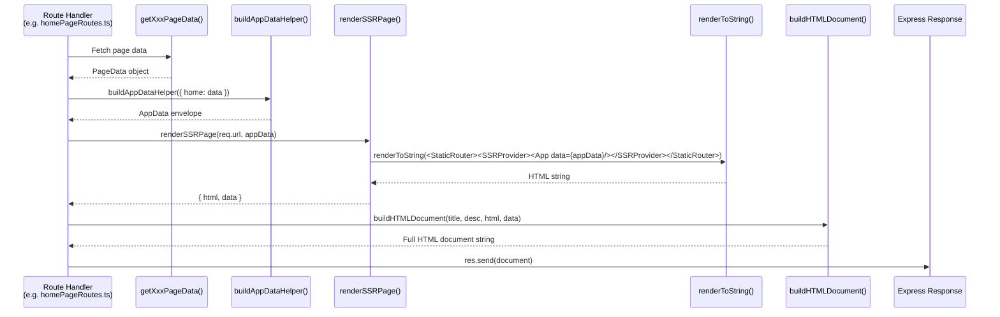

---

## 4. Client Entry

**File:** `src/client.tsx`

This is the browser-side entry point. It runs after the HTML document loads and determines whether to hydrate server-rendered content or do a fresh client render.

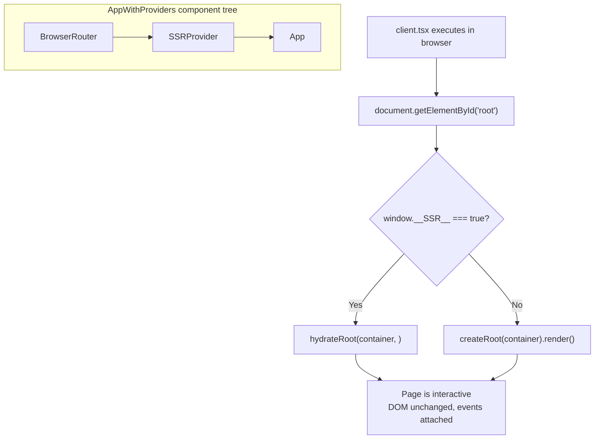

Both paths wrap the app in the same provider tree: `BrowserRouter` > `SSRProvider` > `App`.

`hydrateRoot()` (React 19) attaches event listeners and React internals to the existing server-rendered DOM without re-rendering it. This is faster than a full render because the HTML is already on screen.

`createRoot().render()` does a full client-side render into the empty `<div id="root">`, used when the page was served by the SPA catch-all.

No `data` prop is passed to `<App>` on the client. Instead, `App` reads `window.__INITIAL_DATA__` directly when `isSSR` is true (see SSR Context System below).

---

## 5. SSR Context System

**File:** `src/frontend/components/hooks/useSSRContext.tsx`

The SSR context is a React context that tracks whether the app is currently using server-provided data or has transitioned to SPA mode. It acts as a one-way switch.

### SSRProvider

The provider component wraps the entire app. It holds:
- `isSSR: boolean` -- initialized from `window.__SSR__` on the client, defaults to `true` on the server.
- `clearSSRData()` -- a callback that permanently transitions the app to SPA mode.

### clearSSRData()

When called:
1. Sets `window.__SSR__ = false`.
2. Sets `window.__INITIAL_DATA__ = undefined`.
3. Sets React state `isSSR` to `false`.

Once called, this is irreversible. The app will never go back to SSR mode during the current page session.

### State Machine

```mermaid
stateDiagram-v2
    [*] --> SSR_Mode
    SSR_Mode --> SPA_Mode: clearSSRData()

    state SSR_Mode {
        note right of SSR_Mode
            isSSR = true
            Data source: window.__INITIAL_DATA__
            Pages receive pre-fetched data via props
        end note
    }

    state SPA_Mode {
        note right of SPA_Mode
            isSSR = false
            Data source: fetch() to /api/v1/...
            Pages receive null, usePageData fetches
        end note
    }
```

The transition is triggered by `InternalLink` (see Shared Components). Every time the user clicks an internal navigation link, `clearSSRData()` is called. This ensures that after the first page load (which may be SSR), all subsequent page data is fetched client-side from the JSON API endpoints.

### useSSRContext()

A consumer hook that returns `{ isSSR, clearSSRData }`. Throws an error if used outside of an `SSRProvider`.

---

## 6. Data Flow and usePageData

**File:** `src/frontend/components/hooks/usePageData.tsx`

The `usePageData` hook is the bridge between SSR data and client-side fetching. Every SSR page component uses it.

```typescript
function usePageData<T>(
  initialData: T | null,
  apiRoute: string
): { data: T | null; loading: boolean; error: Error | null }
```

### Decision Flow

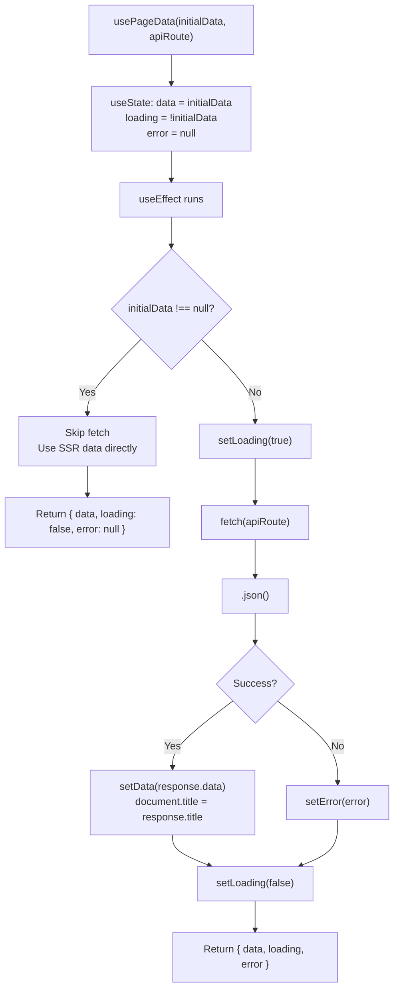

The hook expects the API to return `{ data: T, title: string }`. On successful fetch, it also updates `document.title` so the browser tab reflects the current page.

The `useEffect` dependency array is `[initialData, apiRoute]`, meaning it only re-fetches if the data source or route changes.

---

## 7. Root Component and Routing

**File:** `src/frontend/App.tsx`

The `App` component is the root of the React tree. It is rendered on both server and client.

### Props

```typescript
interface AppProps {
  data?: AppData; // Only passed during SSR on server
}
```

On the server, `renderSSRPage()` passes the `AppData` object as a prop. On the client, no prop is passed.

### Data Resolution

```typescript
const appData: AppData = isSSR
  ? data || window.__INITIAL_DATA__ || { home: null, about: null, products: null, post: null }
  : { home: null, about: null, products: null, post: null };
```

When `isSSR` is true, the component tries the server-provided prop first, then falls back to `window.__INITIAL_DATA__`. When `isSSR` is false (after `clearSSRData()`), all data slots are null, forcing each page to fetch its own data via `usePageData`.

### Route Table

| Path | Component | Data Prop |
|------|-----------|-----------|
| `/` | `HomePage` | `appData.home` |
| `/about` | `AboutPage` | `appData.about` |
| `/post/:id` | `PostPage` | `appData.post` |
| `*` | SPA fallback (inline) | None |

### Layout

The app renders a fixed-position `Header`, a flex-grow main content area containing the `<Routes>`, and a `SiteFooter`. The main area has a `57px` top margin to account for the fixed header height.

---

## 8. Type System

**File:** `src/types/pageTypes.ts`

### PageProps\<T\>

Generic interface used by all page components:

```typescript
interface PageProps<T> {
  data: T | null;
}
```

When `data` is null, the page knows it needs to fetch its own data. When non-null, the data was provided by SSR.

### AppData

The top-level data envelope. Has one nullable slot per SSR page:

```typescript
interface AppData {
  home: HomePageData | null;
  about: AboutPageData | null;
  products: null;
  post: PostPageData | null;
}
```

Only one slot is ever populated at a time (the slot matching the current SSR route). The `products` slot is always null (reserved for future use).

### buildAppDataHelper()

Convenience function so route handlers don't have to manually set every null field:

```typescript
buildAppDataHelper({ home: data })
// returns { home: data, about: null, products: null, post: null }
```

### Per-Page Data Interfaces

- `HomePageData` -- `{ highlightedArticles: Article[] }`
- `AboutPageData` -- `{ message: string, company: string }`
- `PostPageData` -- `{ post: Article, content: string }`
- `Article` -- `{ slug, title, description, date, "time-to-read" }`

### Window Global Augmentation

```typescript
declare global {
  interface Window {
    __INITIAL_DATA__?: AppData;
    __SSR__: boolean;
  }
}
```

These globals are set by the HTML document (via inline `<script>` tags) and read by `client.tsx` and `useSSRContext`.

---

## 9. Per-Page Route Pattern

Every SSR page follows a consistent 4-file convention inside `src/frontend/pages/<name>/`.

### File Relationships

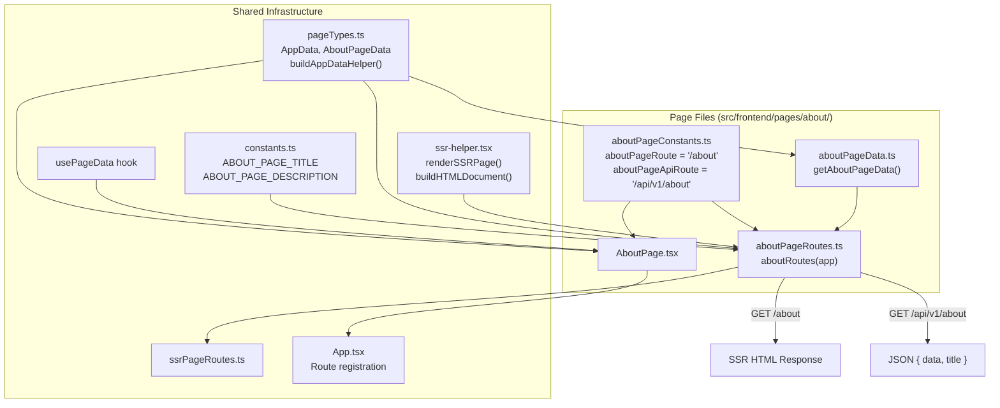

### The 4 Files

**1. Constants** (`aboutPageConstants.ts`)

Exports the page's URL path and its corresponding API path:

```typescript
export const aboutPageRoute = "/about";
export const aboutPageApiRoute = API_ROUTES_ROOT + aboutPageRoute;
// API_ROUTES_ROOT = "/api/v1"
```

**2. Data Fetcher** (`aboutPageData.ts`)

An async function that returns the page's data. This runs on the server for both the SSR route and the API route:

```typescript
export const getAboutPageData = async (): Promise<AboutPageData> => {
  return { message: "About page SSR data", company: "Tropical Galaxy Inc" };
};
```

**3. Route Handler** (`aboutPageRoutes.ts`)

Registers **two** Express routes:

- **SSR route** (`GET /about`) -- calls the data fetcher, runs `renderSSRPage()`, wraps in `buildHTMLDocument()`, sends full HTML.
- **API route** (`GET /api/v1/about`) -- calls the same data fetcher, returns `{ data, title }` as JSON.

The dual-route pattern is why client-side navigation works. When the user navigates to `/about` via an `InternalLink`, React Router renders `AboutPage` on the client, and `usePageData` fetches from `/api/v1/about`.

**4. Component** (`AboutPage.tsx`)

A React component that implements `PageProps<AboutPageData>`. It calls `usePageData` with its initial data prop and the API route. Renders a `<Loader>` while loading, an error message on failure, or the page content on success.

### Route Aggregation

`src/routes/ssrPageRoutes.ts` imports all page route initializers and calls them in sequence:

```typescript
export const ssrPageRoutes = (app: Application) => {
  homeRoutes(app);
  aboutRoutes(app);
  postRoutes(app);
};
```

This function is called once during server bootstrap (line 98 of `server.ts`).

### Post Page Variant

The post page (`src/frontend/pages/post/`) follows the same pattern but adds dynamic URL parameters:

- Route path: `/post/:id` and `/api/v1/post/:id`
- The route handler extracts `req.params.id` as the slug.
- `getPostPageData(slug)` calls `loadPost(slug)` from the posts service, returning null if the post doesn't exist.
- The handler returns 404 for missing posts.
- `PostPage.tsx` computes the API route dynamically from `window.location.pathname` when in SPA mode (since the `:id` parameter isn't available as a React Router param in the hook).

### Vite Server Config Integration

Each page route file must also be added as an entry point in `vite.config.server.ts` so it gets built as a separate SSR module:

```typescript
rollupOptions: {
  input: {
    "pages/about/aboutPageRoutes": "./src/frontend/pages/about/aboutPageRoutes.ts",
    // ...other entries
  },
},
```

---

## 10. Robots.txt System

Two files handle dynamic `robots.txt` generation.

### Service (`src/services/robots.ts`)

`generateRobotsTxt(config)` accepts a `RobotsConfig` object:

```typescript
interface RobotsConfig {
  allowPaths?: string[];
  disallowPaths?: string[];
  sitemapUrl?: string;
  userAgent?: string; // defaults to "*"
}
```

It builds a standard `robots.txt` string with `User-agent`, `Allow`, `Disallow`, and optional `Sitemap` directives.

### Route (`src/routes/robotsRoutes.ts`)

Registers `GET /robots.txt` on the Express app. Calls `generateRobotsTxt()` with the desired configuration and responds with `Content-Type: text/plain`.

Currently configured with empty `disallowPaths` (allows all paths) and no sitemap URL.

### Registration Order

The robots route is registered **before** Vite middleware in both dev and prod modes. This is critical in development because Vite's middleware would otherwise intercept the `/robots.txt` request and either serve a static file or return a 404. By registering the Express route first, Express handles it and Vite never sees the request.

---

## 11. Markdown Content Pipeline

The blog content system has three layers that transform markdown files on disk into rendered React components.

### Processing Pipeline

```mermaid
flowchart LR
    MD["posts/*.md<br/>Markdown files<br/>with YAML frontmatter"]
    MD --> Parse["parseMarkdownMetadata()<br/>parse-markdown-metadata.ts"]
    Parse --> Meta["{ metadata, content }<br/>Frontmatter separated<br/>from body"]
    Meta --> PostService["posts.ts<br/>loadPost() / loadAllPosts()"]
    PostService --> PostObj["Post / PostMeta objects<br/>with slug from filename"]
    PostObj --> DataFetcher["getPostPageData()<br/>/ getHomePageData()"]
    DataFetcher --> SSROrAPI["SSR render or<br/>JSON API response"]
    SSROrAPI --> ComponentRender["PostPage.tsx receives data"]
    ComponentRender --> MarkdownJSX["markdownToJsx()<br/>markdown-to-jsx.tsx"]
    MarkdownJSX --> ReactElements["React elements<br/>rendered in browser"]
```

### Layer 1: Frontmatter Parser (`src/services/parse-markdown-metadata.ts`)

`parseMarkdownMetadata(fileContent)` takes the raw string content of a markdown file and:

1. Validates the file starts with `---`.
2. Finds the closing `---` delimiter.
3. Parses the YAML frontmatter between the delimiters into key-value pairs (simple colon-separated parsing, not a full YAML library).
4. Strips quotes from values.
5. Validates that all required keys are present: `title`, `description`, `date`, `time-to-read`.
6. Returns `{ metadata: MarkdownMetadata, content: string }` where `content` is everything after the closing `---`.

Throws an error with a descriptive message if required keys are missing or delimiters are malformed.

### Layer 2: Post Loader (`src/services/posts.ts`)

A filesystem-based content management system.

**`getPostsDirectory()`** resolves the posts folder:
- Production: `dist/posts/` (posts are copied there during build).
- Development: `posts/` from the project root.

**`loadAllPosts()`** reads all `.md` files from the posts directory, parses each one with `parseMarkdownMetadata()`, adds a `slug` field (the filename without `.md`), sorts by date descending, and returns an array of `PostMeta` objects.

**`loadPost(slug)`** loads a single post by slug. Returns the full `Post` object (metadata + content) or null if the file doesn't exist.

**`postExists(slug)`** and **`getAllPostSlugs()`** are utility functions for checking existence and listing all slugs.

Date parsing supports `DD-MM-YYYY` format (the format used in the posts' frontmatter) with a fallback to native `Date` parsing.

### Layer 3: Markdown-to-JSX Parser (`src/services/markdown-to-jsx.tsx`)

A custom recursive parser that converts markdown strings into React elements. No external markdown library is used.

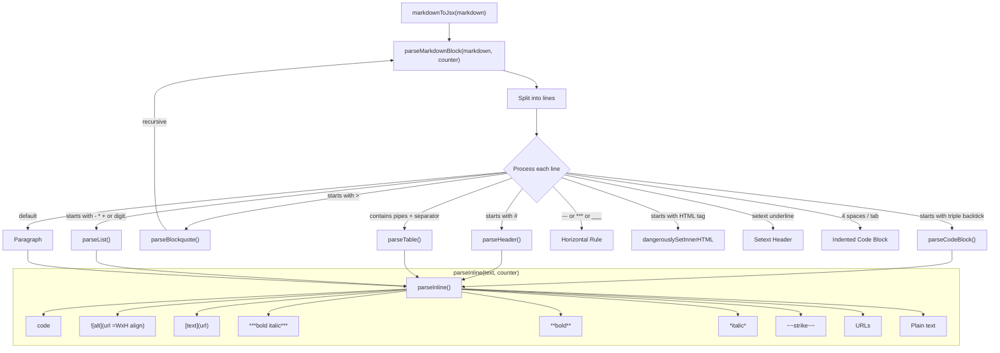

**Key design decisions:**
- Uses a `KeyCounter` object (`{ value: number }`) passed through all parsing functions. This produces deterministic React keys (`md-0`, `md-1`, ...) that are identical between server and client renders, preventing hydration mismatches.
- Images support extended syntax: `` where width, height, and alignment (left/center/right/inline) are optional.
- Images use `<span>` wrappers instead of `<div>` to avoid hydration errors when images appear inside `<p>` tags.
- Blockquotes are recursive -- the content inside a blockquote is parsed again through `parseMarkdownBlock()`.
- Lists support nesting via indentation detection.

The `Markdown` component provides a convenient wrapper:

```typescript
function Markdown({ content, className }: MarkdownProps): React.ReactElement
```

It renders `markdownToJsx(content)` inside a `<div className="md-content">`, which applies the global markdown styles from `global.css`.

---

## 12. Shared Components

### InternalLink (`src/frontend/components/shared/internalLink.tsx`)

Wraps React Router's `<Link>` component. On click, it calls `clearSSRData()` from the SSR context before navigation. This is the mechanism that transitions the app from SSR mode to SPA mode.

```typescript
const InternalLink = ({ href, children, linkStyle }) => {
  const { clearSSRData } = useSSRContext();
  return <Link to={href} onClick={clearSSRData} style={linkStyle}>{children}</Link>;
};
```

Every internal navigation in the app should use `InternalLink` instead of `<Link>` directly to ensure the SSR-to-SPA transition happens correctly.

### Loader (`src/frontend/components/shared/loader.tsx`)

An animated SVG loader that reveals the letters "ZM" (Zachary Metz) using a stroke-dasharray animation. The animation has five phases:
1. Animate the third stroke segment (reveal the letters).
2. Pause for 1 second.
3. Animate the second stroke segment (fill effect).
4. Pause for 1 second.
5. Reset and loop.

Used as the loading state by all page components when `usePageData` is fetching.

### Header (`src/frontend/components/shared/siteHeader.tsx`)

A fixed-position header (`position: fixed`, `z-index: 1000`, `height: 56px`) with:
- Site logo (`/coffee.png`) and name ("Zachary Metz.com") linking to `/` via `InternalLink`.
- Space for navigation links (currently commented out).
- White background with bottom border.
- Max width of 1440px, centered.

### SiteFooter (`src/frontend/components/shared/siteFooter.tsx`)

Footer component containing:
- Copyright notice.
- Link to tropicalgalaxy.io with logo.
- Live cryptocurrency price ticker (via `useCryptoPrices` hook) showing BTC, ETH, SOL, XMR with 24h change percentages.
- Mascot image (`/doomer.png`, flipped horizontally).
- Responsive layout using `useDetectIsMobile` -- prices stack vertically on mobile/tablet, display in a row on medium/large screens.

---

## 13. Hooks

### useDetectIsMobile (`src/frontend/components/hooks/useDetectIsMobile.tsx`)

A responsive breakpoint hook built on React's `useSyncExternalStore`.

**Breakpoints:**

| Screen Size | Width Range | ID |
|-------------|------------|-----|
| Mobile | < 736px | `mobile` |
| Tablet | 736px - 1023px | `tablet` |
| Medium | 1024px - 1279px | `medium` |
| Large | >= 1280px | `large` |

**Returns** `ScreenSizeInfo`:
```typescript
{ width, screenSize, isMobile, isTablet, isMedium, isLarge }
```

**Implementation details:**
- Subscribes to `window.resize` events via `useSyncExternalStore`.
- Caches the snapshot object and only creates a new one when the `screenSize` category changes (not on every pixel of resize). This prevents unnecessary re-renders.
- SSR default: returns `mobile` (736px - 1) to ensure server and client produce the same initial render for the smallest common denominator.

### useCryptoPrices (`src/frontend/components/hooks/useCryptoPrices.ts`)

A WebSocket-based live price feed.

**Connects to:** `wss://data-streamer.cryptocompare.com/`

**Subscribes to:** BTC-USD, ETH-USD, SOL-USD, XMR-USD via the CryptoCompare streaming API.

**Message format:** Listens for `TYPE === "1101"` messages containing `VALUE` (current price) and `MOVING_24_HOUR_CHANGE_PERCENTAGE` (24h change).

**Returns:**
```typescript
{
  tokensData: Record<TokenPair, { price: number, priceChange: number }>,
  tokenPairs: TokenPair[]
}
```

The WebSocket connection is opened on mount and closed on unmount. State updates use the functional form of `setTokensData` to merge incoming data without losing other tokens.

---

## 14. Build Pipeline

**Files:** `build.js`, `vite.config.ts`, `vite.config.server.ts`

### Build Steps

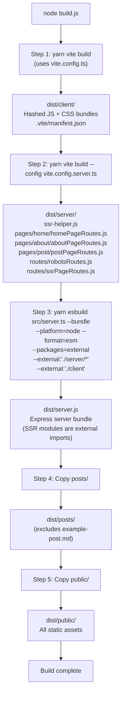

### Production Directory Structure

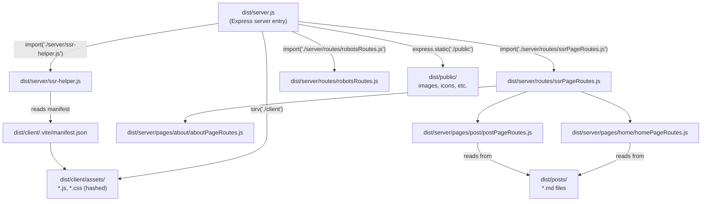

### Vite Client Config (`vite.config.ts`)

- **Entry:** `src/client.tsx`
- **Output:** `dist/client/`
- **Manifest:** enabled -- generates `.vite/manifest.json` mapping source paths to hashed output paths.
- **CSS Modules:** camelCase convention with scoped names `[name]__[local]--[hash:base64:5]`.
- **SSR noExternal:** `lenis` and `react-router` are bundled into the SSR output instead of being left as Node.js imports.
- **Path alias:** `@` maps to `./src`.

### Vite Server Config (`vite.config.server.ts`)

- **Output:** `dist/server/` in SSR mode.
- **Multiple entry points:** Each SSR module is a separate entry to preserve code-splitting.
  - `ssr-helper` -> `./src/ssr-helper.tsx`
  - `pages/home/homePageRoutes` -> `./src/frontend/pages/home/homePageRoutes.ts`
  - `pages/about/aboutPageRoutes` -> `./src/frontend/pages/about/aboutPageRoutes.ts`
  - `pages/post/postPageRoutes` -> `./src/frontend/pages/post/postPageRoutes.ts`
  - `routes/robotsRoutes` -> `./src/routes/robotsRoutes.ts`
  - `routes/ssrPageRoutes` -> `./src/routes/ssrPageRoutes.ts`
- **Output filenames:** `[name].js` -- preserves the directory structure from the entry names.

### esbuild Step (Step 3)

Bundles `src/server.ts` into a single `dist/server.js` with these critical flags:
- `--platform=node` -- target Node.js environment.
- `--format=esm` -- output ESM (the project uses `"type": "module"`).
- `--packages=external` -- all `node_modules` dependencies stay as external imports (not bundled).
- `--external:"./server/*"` -- SSR modules (built by Step 2) remain as dynamic imports, not inlined.
- `--external:"./client"` -- client assets are not bundled into the server.

This keeps `dist/server.js` small and allows SSR modules to be loaded lazily at runtime.

### build.js Features

The build orchestrator includes:
- Sequential step execution with colored terminal output.
- Memory tracking via `process.memoryUsage()` with periodic polling (every 500ms).
- Final build statistics: total time, max heap usage, final memory breakdown.
- Error handling: exits with code 1 if any step fails.

---

## 15. CSS Architecture

### Global Styles (`src/frontend/styles/global.css`)

Imported in `App.tsx`. Contains:

**Base reset:**
- Removes default margin/padding on `html` and `body`.
- Sets system font stack and text color (`rgb(55, 53, 47)` -- Notion-like dark gray).
- Ensures full viewport height and prevents horizontal overflow.

**Markdown styles (`.md-*` classes):**

All markdown-rendered content is styled through CSS classes applied by `markdown-to-jsx.tsx`:

| Class | Element | Key Styles |
|-------|---------|------------|
| `.md-content` | Wrapper | `line-height: 1.7`, `font-size: 1rem` |
| `.md-h1` through `.md-h6` | Headers | Decreasing sizes from `2.25em` to `1em` |
| `.md-paragraph` | Paragraphs | `1em` vertical margin |
| `.md-bold` / `.md-italic` | Emphasis | `font-weight: 600` / `font-style: italic` |
| `.md-link` | Links | Blue (#0366d6), underline on hover |
| `.md-image-wrapper` | Block images | Flex with alignment classes (left/center/right) |
| `.md-image-inline` | Inline images | `display: inline`, size scales with font |
| `.md-inline-code` | Inline code | Gray background, monospace font |
| `.md-code-block` | Code blocks | Dark theme (#1e1e1e bg), monospace, rounded |
| `.md-ordered-list` / `.md-unordered-list` | Lists | Nested list style progression (disc > circle > square) |
| `.md-table` | Tables | Collapsed borders, striped rows, full width |
| `.md-blockquote` | Blockquotes | Left border, gray background, muted text |
| `.md-hr` | Horizontal rules | 2px top border |

### TypeScript CSS Declarations (`src/types/css.d.ts`)

Declares module types for `.css` and `.module.css` imports so TypeScript doesn't error when importing stylesheets:

```typescript
declare module '*.css' { ... }
declare module '*.module.css' { ... }
```

### CSS Modules Configuration

Both Vite configs enable CSS Modules with:
- `localsConvention: "camelCase"` -- class names like `my-class` can be accessed as `myClass` in JS.
- `generateScopedName: "[name]__[local]--[hash:base64:5]"` -- BEM-like scoped names with hash for uniqueness.

CSS Modules are **configured but not actively used** by existing components. All current styling is either inline styles (on components) or global CSS classes (for markdown rendering). The configuration is in place for future use.
